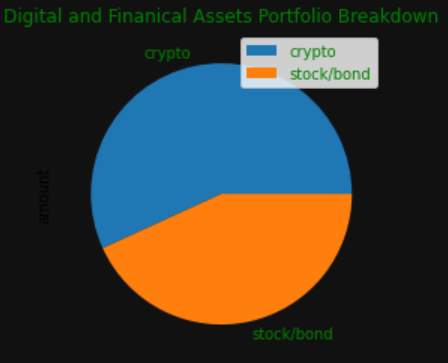
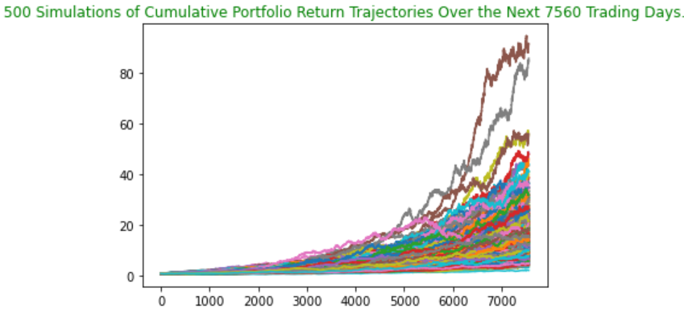

# *Financial Analysis*

This is a Python-based tool that is helping a local community with financial planning.  The first part of the tool helps members assess their monthly budgets.  The second part helps forecast a retirement plan based on their current portfolio and likely growth rates.

---

## Technologies

The application is written in Python 3.7 in a Jupyter notebook with support from the following packages:  

*[Pandas] (https://github.com/pandas) - Data analysis

*[Json] (https://github.com/nemec/pathlib) - Import files

*[Matplotlib] (https://github.com/matplotlib) - Plotting tools

*[Os] (https://github.com/topics/os) - Accessing ENV files

*[Requests] (https://github.com/topics/psf/requests) - Accessing JSON files

*[MCForecastTools] - Monte Carlo Simulation

## Installation Guide

Install python-dotenv library through the command **pip install python-dotenv**

Install Alpaca SDK through the command **pip install alpaca-trade-api**

## Usage and Content

To see the analysis, pls clone the repository and open **financial_planning_tools.ipyn** in JupyterLab.  

Pls also create an .env file with Alpaca API keys.  

Here are a few images from the analysis to provide a sample of what can be found:

## Contributors
Vishnu Kurella, vishnu.kurella@gmail.com

## License
VK.LQA 2021